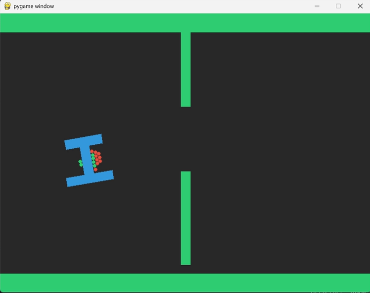
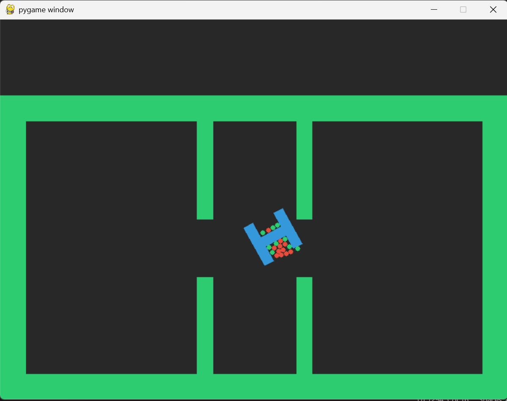

## Laukiak eta zirkuluak marrazteko komandoak

Hau jarri beti, indarrak aplikatzerakoan while horren barruan sartu ere. Gauza estatikoak ez.
```{python}
#| eval: false
#| echo: true
ejecutando = True
while ejecutando:

    #hemen indarrak nola aplikatu zehazten du, hau adibidea da
    punto_local = (0, 2) 
    punto_mundo = carga.GetWorldPoint(punto_local)
    fuerza=(-100, 0)
    fuerza_pegada= carga.GetWorldVector(fuerza)
    carga.ApplyForce(force=fuerza_pegada, point=punto_mundo, wake=True)
    carga.ApplyForceToCenter(force=(110, 0), wake=True)

    #Hau garrantzitsua
    for evento in pygame.event.get():
        if evento.type == pygame.QUIT: ejecutando = False

    pantalla.fill((40, 40, 40))

    # Dibujar todo lo que hay en el mundo
    for body in mundo.bodies:
        for fixture in body.fixtures:
            shape = fixture.shape
            if isinstance(shape, b2PolygonShape):
                vertices = [to_pygame(body.transform * v) for v in shape.vertices]
                color = (46, 204, 113) if body.type == Box2D.b2_staticBody else (52, 152, 219)
                pygame.draw.polygon(pantalla, color, vertices)
            elif isinstance(shape, b2CircleShape):
                pos_mundo = body.transform * shape.pos # Posición real del círculo
                centro_px = to_pygame(pos_mundo)       # Pasar a píxeles
                radio_px = int(shape.radius * PPM)     # Radio en píxeles
                pygame.draw.circle(pantalla, (231, 76, 60), centro_px, radio_px) # Rojo hormiga

    mundo.Step(1.0/TARGET_FPS, 6, 2)
    pygame.display.flip()
    reloj.tick(TARGET_FPS)

pygame.quit()
```

Honekin gauza dinamikoak urdinez, estatikoak berdez eta zirkularrak gorriz agertzen dira. 

## Bi mapa ezberdinak

Hau gemini egindakoa da, zirrikitu bakarrarekin eta pixelak ondo jarrita:


```{python}
#| eval: false
#| echo: true
# --- CONFIGURACIÓN ---
PPM = 20.0  # Píxeles por metro
SCREEN_WIDTH, SCREEN_HEIGHT = 800, 600
TARGET_FPS = 60

# 1. MUNDO SIN GRAVEDAD (Vista desde arriba)
mundo = b2World(gravity=(0, 0))

# 2. LA ARENA (Paredes estáticas)
# Creamos un solo cuerpo para todas las paredes
paredes = mundo.CreateStaticBody(position=(0, 0))

# Pared Superior e Inferior
paredes.CreatePolygonFixture(box=(40, 1, (20, 29), 0)) # Techo
paredes.CreatePolygonFixture(box=(40, 1, (20, 1), 0))  # Suelo

# LA RENDIJA (Slit): Dos muros verticales con un hueco en medio
# Muro de arriba
paredes.CreatePolygonFixture(box=(0.5, 5, (20, 25), 0))
# Muro de abajo
paredes.CreatePolygonFixture(box=(0.5, 5, (20, 8), 0))
# El hueco queda entre y=15 y y=20 (5 metros de ancho)
```




Nik egindakoa, un poco más cutre pero las dimensiones parecidas a las del artículo:


```{python}
#| eval: false
#| echo: true
# --- CONFIGURACIÓN ---
PPM = 20.0  # Píxeles por metro
SCREEN_WIDTH, SCREEN_HEIGHT = 800, 600
TARGET_FPS = 60

mundo = b2World(gravity=(0, 0))

#------------ PAREDES-----------------------
paredes=mundo.CreateStaticBody(position=(0,0))

paredes.CreatePolygonFixture(box=(1, 12, (1, 12), 0)) # Techo
paredes.CreatePolygonFixture(box=(1, 12, (39, 12), 0))
paredes.CreatePolygonFixture(box=(20, 1, (20, 1), 0))
paredes.CreatePolygonFixture(box=(20, 1, (20, 23), 0))

paredes.CreatePolygonFixture(box=(0.6, 4.825, (16.15, 4.825), 0))
paredes.CreatePolygonFixture(box=(0.6, 4.825, (16.15, 19.05), 0))
paredes.CreatePolygonFixture(box=(0.6, 4.825, (23.95, 19.05), 0))
paredes.CreatePolygonFixture(box=(0.6, 4.825, (23.95, 4.825), 0))
```




## Zirrikitu bakarra probak

Honekin beti ateratzen da, zirrikiturantz eta aurrerantz daude indarrak: 

```{python}
import random
import pygame
import Box2D
from Box2D import b2World, b2PolygonShape, b2CircleShape

# --- CONFIGURACIÓN ---
PPM = 20.0  # Píxeles por metro
SCREEN_WIDTH, SCREEN_HEIGHT = 800, 600
TARGET_FPS = 60

# 1. MUNDO SIN GRAVEDAD (Vista desde arriba)
mundo = b2World(gravity=(0, 0))

# 2. LA ARENA (Paredes estáticas)
# Creamos un solo cuerpo para todas las paredes
paredes = mundo.CreateStaticBody(position=(0, 0))

# Pared Superior e Inferior
paredes.CreatePolygonFixture(box=(40, 1, (20, 29), 0)) # Techo
paredes.CreatePolygonFixture(box=(40, 1, (20, 1), 0))  # Suelo

# LA RENDIJA (Slit): Dos muros verticales con un hueco en medio
# Muro de arriba
paredes.CreatePolygonFixture(box=(0.5, 5, (20, 25), 0))
# Muro de abajo
paredes.CreatePolygonFixture(box=(0.5, 5, (20, 8), 0))
# El hueco queda entre y=15 y y=20 (5 metros de ancho) CENTRO x=20 y=17.5

# 3. LA CARGA EN T (El "Piano")
carga = mundo.CreateDynamicBody(position=(10, 15), angle=0)
# Palo vertical
carga.CreatePolygonFixture(box=(0.5, 2), density=1.0)
# Tejado de la T
forma_tejado = b2PolygonShape()
forma_tejado.SetAsBox(2, 0.5, (0, 2), 0)
carga.CreatePolygonFixture(shape=forma_tejado, density=1.0)

forma_suelo= b2PolygonShape()
forma_suelo.SetAsBox(2.5, 0.5, (0,-2), 0)
carga.CreatePolygonFixture(shape=forma_suelo, density=1.0)

# --- BUCLE DE VISUALIZACIÓN ---
pygame.init()
pantalla = pygame.display.set_mode((SCREEN_WIDTH, SCREEN_HEIGHT))
reloj = pygame.time.Clock()

def to_pygame(pt):
    return (int(pt[0] * PPM), int(SCREEN_HEIGHT - pt[1] * PPM))

hormigas=[]
for i in range(15):  # Vamos a crear 15 hormigas para empezar
    # 1. Posición aleatoria en la Cámara 1 (x entre 2 y 18, y entre 5 y 25)
    x_azar = random.uniform(2, 18)
    y_azar = random.uniform(5, 25)
    
    # 2. Crear el cuerpo (pequeños círculos)
    hormiga = mundo.CreateDynamicBody(position=(x_azar, y_azar), angle=0)
    
    # 3. Darle forma de círculo (radio de 0.2 metros)
    forma_circulo = b2CircleShape(radius=0.2)
    hormiga.CreatePolygonFixture(shape=forma_circulo, density=0.5, friction=0.3)
    
    # 4. ¡Al autobús! La guardamos en la lista
    hormigas.append(hormiga)

ejecutando = True
while ejecutando:
    for evento in pygame.event.get():
        if evento.type == pygame.QUIT: ejecutando = False


    
    punto_local = (0, 2) 
    punto_mundo = carga.GetWorldPoint(punto_local) 

    for h in hormigas:
        
        pos_h=h.position
        pos_t=carga.position
        #Voy a intentar que la fuerza apunte al centro de la salida 
        salida=Box2D.b2Vec2(20, 19)
        derecha= Box2D.b2Vec2(1, 0)
        

        f_c=pos_t-pos_h 
        f_total= salida-pos_h 

        fy= f_total.y
        fx= 1.0

        fuerza_ok=Box2D.b2Vec2(3*fx, fy)

        esta_tocando_carga = False
        for contacto in h.contacts: 
            if contacto.contact.touching and contacto.other == carga:
                esta_tocando_carga = True
                break

        if esta_tocando_carga:
            h.ApplyForceToCenter(force=fuerza_ok, wake=True)
            h.linearDamping = 10.0
        else:
            h.ApplyForceToCenter(force=f_c, wake=True)
            h.linearDamping = 2.0

    pantalla.fill((40, 40, 40))

    # Dibujar todo lo que hay en el mundo
    for body in mundo.bodies:
        for fixture in body.fixtures:
            shape = fixture.shape
            if isinstance(shape, b2PolygonShape):
                vertices = [to_pygame(body.transform * v) for v in shape.vertices]
                color = (46, 204, 113) if body.type == Box2D.b2_staticBody else (52, 152, 219)
                pygame.draw.polygon(pantalla, color, vertices)

            elif isinstance(shape, b2CircleShape):
                pos_mundo = body.transform * shape.pos 
                centro_px = to_pygame(pos_mundo)       
                radio_px = int(shape.radius * PPM)     
                pygame.draw.circle(pantalla, (231, 76, 60), centro_px, radio_px) 
            
                distancia = (body.position - carga.position).length

                esta_tocando_carga = False
                for contacto in body.contacts:
                    if contacto.contact.touching and contacto.other == carga:
                        esta_tocando_carga = True
                        break 

                if esta_tocando_carga:
                    color = (46, 204, 113)  
                else:
                    color = (231, 76, 60) 
    
                pygame.draw.circle(pantalla, color, centro_px, radio_px)

    mundo.Step(1.0/TARGET_FPS, 6, 2)
    pygame.display.flip()
    reloj.tick(TARGET_FPS)

pygame.quit()
```

Inurriak tiratzen dute atzeraka? aleatorioki denak kokatuko ditut kargaren eskubialdean ea jarraitzen den ateratzen. 

```{python}
import random
import pygame
import Box2D
from Box2D import b2World, b2PolygonShape, b2CircleShape

# --- CONFIGURACIÓN ---
PPM = 20.0  # Píxeles por metro
SCREEN_WIDTH, SCREEN_HEIGHT = 800, 600
TARGET_FPS = 60

# 1. MUNDO SIN GRAVEDAD (Vista desde arriba)
mundo = b2World(gravity=(0, 0))

# 2. LA ARENA (Paredes estáticas)
# Creamos un solo cuerpo para todas las paredes
paredes = mundo.CreateStaticBody(position=(0, 0))

# Pared Superior e Inferior
paredes.CreatePolygonFixture(box=(40, 1, (20, 29), 0)) # Techo
paredes.CreatePolygonFixture(box=(40, 1, (20, 1), 0))  # Suelo

# LA RENDIJA (Slit): Dos muros verticales con un hueco en medio
# Muro de arriba
paredes.CreatePolygonFixture(box=(0.5, 5, (20, 25), 0))
# Muro de abajo
paredes.CreatePolygonFixture(box=(0.5, 5, (20, 8), 0))
# El hueco queda entre y=15 y y=20 (5 metros de ancho) CENTRO x=20 y=17.5

# 3. LA CARGA EN T (El "Piano")
carga = mundo.CreateDynamicBody(position=(10, 15), angle=0)
# Palo vertical
carga.CreatePolygonFixture(box=(0.5, 2), density=1.0)
# Tejado de la T
forma_tejado = b2PolygonShape()
forma_tejado.SetAsBox(2, 0.5, (0, 2), 0)
carga.CreatePolygonFixture(shape=forma_tejado, density=1.0)

forma_suelo= b2PolygonShape()
forma_suelo.SetAsBox(2.5, 0.5, (0,-2), 0)
carga.CreatePolygonFixture(shape=forma_suelo, density=1.0)

# --- BUCLE DE VISUALIZACIÓN ---
pygame.init()
pantalla = pygame.display.set_mode((SCREEN_WIDTH, SCREEN_HEIGHT))
reloj = pygame.time.Clock()

def to_pygame(pt):
    return (int(pt[0] * PPM), int(SCREEN_HEIGHT - pt[1] * PPM))

hormigas=[]
for i in range(5):  # Vamos a crear 15 hormigas para empezar
    # 1. Posición aleatoria en la Cámara 1 (x entre 2 y 18, y entre 5 y 25)
    x_azar = random.uniform(11, 18)
    y_azar = random.uniform(5, 25)
    
    # 2. Crear el cuerpo (pequeños círculos)
    hormiga = mundo.CreateDynamicBody(position=(x_azar, y_azar), angle=0)
    
    # 3. Darle forma de círculo (radio de 0.2 metros)
    forma_circulo = b2CircleShape(radius=0.2)
    hormiga.CreatePolygonFixture(shape=forma_circulo, density=0.5, friction=0.3)
    
    # 4. ¡Al autobús! La guardamos en la lista
    hormigas.append(hormiga)

ejecutando = True
while ejecutando:
    for evento in pygame.event.get():
        if evento.type == pygame.QUIT: ejecutando = False


    
    punto_local = (0, 2) 
    punto_mundo = carga.GetWorldPoint(punto_local) 

    for h in hormigas:
        
        pos_h=h.position
        pos_t=carga.position
        #Voy a intentar que la fuerza apunte al centro de la salida 
        salida=Box2D.b2Vec2(20, 19)
        derecha= Box2D.b2Vec2(1, 0)
        

        f_c=pos_t-pos_h 
        f_total= salida-pos_h 

        fy= f_total.y
        fx= 1.0

        fuerza_ok=Box2D.b2Vec2(3*fx, fy)

        esta_tocando_carga = False
        for contacto in h.contacts: 
            if contacto.contact.touching and contacto.other == carga:
                esta_tocando_carga = True
                break

        if esta_tocando_carga:
            h.ApplyForceToCenter(force=fuerza_ok, wake=True)
            h.linearDamping = 20.0
        else:
            h.ApplyForceToCenter(force=f_c, wake=True)
            h.linearDamping = 2.0

    pantalla.fill((40, 40, 40))

    # Dibujar todo lo que hay en el mundo
    for body in mundo.bodies:
        for fixture in body.fixtures:
            shape = fixture.shape
            if isinstance(shape, b2PolygonShape):
                vertices = [to_pygame(body.transform * v) for v in shape.vertices]
                color = (46, 204, 113) if body.type == Box2D.b2_staticBody else (52, 152, 219)
                pygame.draw.polygon(pantalla, color, vertices)

            elif isinstance(shape, b2CircleShape):
                pos_mundo = body.transform * shape.pos 
                centro_px = to_pygame(pos_mundo)       
                radio_px = int(shape.radius * PPM)     
                pygame.draw.circle(pantalla, (231, 76, 60), centro_px, radio_px) 
            
                distancia = (body.position - carga.position).length

                esta_tocando_carga = False
                for contacto in body.contacts:
                    if contacto.contact.touching and contacto.other == carga:
                        esta_tocando_carga = True
                        break 

                if esta_tocando_carga:
                    color = (46, 204, 113)  
                else:
                    color = (231, 76, 60) 
    
                pygame.draw.circle(pantalla, color, centro_px, radio_px)

    mundo.Step(1.0/TARGET_FPS, 6, 2)
    pygame.display.flip()
    reloj.tick(TARGET_FPS)

pygame.quit()
```

Ikus daiteke nola aurreko programaren berdina uzten badut (indarren moduluak berdin) ez da ateratzen, ezkerrerantz doa beti. Uste dut, handiagoa dela T-rantz joateko indarra irteerarantz egiten duten indarra baino. Hau da, oso inurri gutxi daude kontaktuan gainazala txikia delako. Saiatuko naiz T-rantz dagoen indarra txikitzen, ea kontaktuan dauden inurri gutxi horiek gai diren edo ez eskubirantz tiratzeko. Baita kopurua txikitu dut. Hau egitean, inurriak ez dira itsatsita gelditzen, ez daukatelako kanpoko puntuak barrurantz bultzatzen. Oso denbora gutxi daudenez kontaktuan ez dute bultzatzen irteerarantz, baizik eta T-rant. 

CONCLUSION: EZ DUTE ATZERANTZ TIRATZEN

Orain saiatuko naiz T hasierako posizioa eta zirrikituaren altuera aleatorioak izaten.


```{python}
import random
import pygame
import Box2D
from Box2D import b2World, b2PolygonShape, b2CircleShape

# --- CONFIGURACIÓN ---
PPM = 20.0  # Píxeles por metro
SCREEN_WIDTH, SCREEN_HEIGHT = 800, 600
TARGET_FPS = 60

# 1. MUNDO SIN GRAVEDAD (Vista desde arriba)
mundo = b2World(gravity=(0, 0))

# 2. LA ARENA (Paredes estáticas)
# Creamos un solo cuerpo para todas las paredes
paredes = mundo.CreateStaticBody(position=(0, 0))

# Pared Superior e Inferior
paredes.CreatePolygonFixture(box=(40, 1, (20, 29), 0)) # Techo
paredes.CreatePolygonFixture(box=(40, 1, (20, 1), 0))  # Suelo

# LA RENDIJA (Slit): Dos muros verticales con un hueco en medio
# Muro de arriba

paredes.CreatePolygonFixture(box=(0.5, 5, (20, 25), 0))
# Muro de abajo
paredes.CreatePolygonFixture(box=(0.5, 5, (20, 8), 0))
# El hueco queda entre y=15 y y=20 (5 metros de ancho) CENTRO x=20 y=17.5

# 3. LA CARGA EN T (El "Piano")
x_h=random.uniform(2, 17)
y_h=random.uniform(7, 23)
carga = mundo.CreateDynamicBody(position=(x_h, y_h), angle=0)
# Palo vertical
carga.CreatePolygonFixture(box=(0.5, 2), density=1.0)
# Tejado de la T
forma_tejado = b2PolygonShape()
forma_tejado.SetAsBox(2, 0.5, (0, 2), 0)
carga.CreatePolygonFixture(shape=forma_tejado, density=1.0)

forma_suelo= b2PolygonShape()
forma_suelo.SetAsBox(2.5, 0.5, (0,-2), 0)
carga.CreatePolygonFixture(shape=forma_suelo, density=1.0)

# --- BUCLE DE VISUALIZACIÓN ---
pygame.init()
pantalla = pygame.display.set_mode((SCREEN_WIDTH, SCREEN_HEIGHT))
reloj = pygame.time.Clock()

def to_pygame(pt):
    return (int(pt[0] * PPM), int(SCREEN_HEIGHT - pt[1] * PPM))

hormigas=[]
for i in range(15):  # Vamos a crear 15 hormigas para empezar
    # 1. Posición aleatoria en la Cámara 1 (x entre 2 y 18, y entre 5 y 25)
    x_azar = random.uniform(1, 18)
    y_azar = random.uniform(5, 25)
    
    # 2. Crear el cuerpo (pequeños círculos)
    hormiga = mundo.CreateDynamicBody(position=(x_azar, y_azar), angle=0)
    
    # 3. Darle forma de círculo (radio de 0.2 metros)
    forma_circulo = b2CircleShape(radius=0.2)
    hormiga.CreatePolygonFixture(shape=forma_circulo, density=0.5, friction=0.3)
    
    # 4. ¡Al autobús! La guardamos en la lista
    hormigas.append(hormiga)

ejecutando = True
while ejecutando:
    for evento in pygame.event.get():
        if evento.type == pygame.QUIT: ejecutando = False


    
    punto_local = (0, 2) 
    punto_mundo = carga.GetWorldPoint(punto_local) 

    for h in hormigas:
        
        pos_h=h.position
        pos_t=carga.position
        #Voy a intentar que la fuerza apunte al centro de la salida 
        salida=Box2D.b2Vec2(20, 19)
        derecha= Box2D.b2Vec2(1, 0)
        

        f_c=pos_t-pos_h 
        f_total= salida-pos_h 

        fy= f_total.y
        fx= 1.0

        fuerza_ok=Box2D.b2Vec2(3*fx, fy)

        esta_tocando_carga = False
        for contacto in h.contacts: 
            if contacto.contact.touching and contacto.other == carga:
                esta_tocando_carga = True
                break

        if esta_tocando_carga:
            h.ApplyForceToCenter(force=fuerza_ok, wake=True)
            h.linearDamping = 10.0
        else:
            h.ApplyForceToCenter(force=f_c, wake=True)
            h.linearDamping = 2.0

    pantalla.fill((40, 40, 40))

    # Dibujar todo lo que hay en el mundo
    for body in mundo.bodies:
        for fixture in body.fixtures:
            shape = fixture.shape
            if isinstance(shape, b2PolygonShape):
                vertices = [to_pygame(body.transform * v) for v in shape.vertices]
                color = (46, 204, 113) if body.type == Box2D.b2_staticBody else (52, 152, 219)
                pygame.draw.polygon(pantalla, color, vertices)

            elif isinstance(shape, b2CircleShape):
                pos_mundo = body.transform * shape.pos 
                centro_px = to_pygame(pos_mundo)       
                radio_px = int(shape.radius * PPM)     
                pygame.draw.circle(pantalla, (231, 76, 60), centro_px, radio_px) 
            
                distancia = (body.position - carga.position).length

                esta_tocando_carga = False
                for contacto in body.contacts:
                    if contacto.contact.touching and contacto.other == carga:
                        esta_tocando_carga = True
                        break 

                if esta_tocando_carga:
                    color = (46, 204, 113)  
                else:
                    color = (231, 76, 60) 
    
                pygame.draw.circle(pantalla, color, centro_px, radio_px)

    mundo.Step(1.0/TARGET_FPS, 6, 2)
    pygame.display.flip()
    reloj.tick(TARGET_FPS)

pygame.quit()
```


Esto lo ha hecho gemini. Se supone que se quedan "mordiendo" la carga. 

```{python}
import random
import pygame
import Box2D
from Box2D import b2World, b2PolygonShape, b2CircleShape, b2DistanceJointDef

# --- CONFIGURACIÓN ---
PPM = 20.0  # Píxeles por metro
SCREEN_WIDTH, SCREEN_HEIGHT = 800, 600
TARGET_FPS = 60

# Inicializar Pygame
pygame.init()
pantalla = pygame.display.set_mode((SCREEN_WIDTH, SCREEN_HEIGHT))
reloj = pygame.time.Clock()

def to_pygame(pt):
    return (int(pt[0] * PPM), int(SCREEN_HEIGHT - pt[1] * PPM))

# 1. MUNDO (Sin gravedad, vista cenital)
mundo = b2World(gravity=(0, 0))

# 2. LAS PAREDES (Arena con rendija)
paredes = mundo.CreateStaticBody(position=(0, 0))
# Bordes exteriores
paredes.CreatePolygonFixture(box=(40, 1, (20, 1), 0))   # Suelo
paredes.CreatePolygonFixture(box=(40, 1, (20, 29), 0))  # Techo
paredes.CreatePolygonFixture(box=(1, 15, (1, 15), 0))   # Pared izq
paredes.CreatePolygonFixture(box=(1, 15, (39, 15), 0))  # Pared der

# Rendija 1 (Slit 1) - Basado en tus medidas
paredes.CreatePolygonFixture(box=(0.6, 4.825, (16.15, 4.825), 0))
paredes.CreatePolygonFixture(box=(0.6, 4.825, (16.15, 19.05), 0))

# 3. LA CARGA (Forma de T)
carga = mundo.CreateDynamicBody(position=(8, 12), angle=0)
# Parte vertical de la T
carga.CreatePolygonFixture(box=(0.4, 1.8), density=2.0, friction=0.3)
# Parte horizontal (arriba y abajo)
carga.CreatePolygonFixture(box=(1.6, 0.4, (0, 1.6), 0), density=2.0)
carga.CreatePolygonFixture(box=(1.7, 0.4, (0, -1.7), 0), density=2.0)

# 4. LAS HORMIGAS
hormigas = []
for i in range(25):
    x_azar = random.uniform(9, 15) # Aparecen a la izquierda
    y_azar = random.uniform(8, 16)
    h = mundo.CreateDynamicBody(position=(x_azar, y_azar), linearDamping=1.0)
    h.CreateCircleFixture(radius=0.2, density=1.0, friction=0.3)
    hormigas.append(h)

# --- DICCIONARIO PARA LAS MORDIDAS (JOINTS) ---
uniones = {} # Guarda {hormiga: joint_objeto}

# Punto objetivo: El centro del primer hueco
objetivo_rendija = Box2D.b2Vec2(16.15, 12.0)

# --- BUCLE PRINCIPAL ---
ejecutando = True
while ejecutando:
    for evento in pygame.event.get():
        if evento.type == pygame.QUIT:
            ejecutando = False

    # --- LÓGICA DE COMPORTAMIENTO ---
    for h in hormigas:
        esta_mordiendo = h in uniones

        if not esta_mordiendo:
            # A. BUSCAR LA CARGA (Presión hacia el centro)
            direccion_a_carga = carga.position - h.position
            direccion_a_carga.Normalize()
            h.ApplyForceToCenter(direccion_a_carga * 5.0, wake=True)
            
            # B. INTENTAR MORDER (Si hay contacto)
            for contacto in h.contacts:
                if contacto.contact.touching and contacto.other == carga:
                    # Crear unión rígida (DistanceJoint con frecuencia 0)
                    union_def = b2DistanceJointDef(
                        bodyA=h,
                        bodyB=carga,
                        anchorA=h.worldCenter,
                        anchorB=h.worldCenter,
                        frequencyHz=0, 
                        dampingRatio=1.0
                    )
                    uniones[h] = mundo.CreateJoint(union_def)
                    break
        else:
            # C. HORMIGA INFORMADA (Ya mordiendo)
            # Su fuerza ahora va SIEMPRE hacia la rendija
            direccion_a_hueco = objetivo_rendija - h.position
            direccion_a_hueco.Normalize()
            
            # Al estar unida por un Joint, esta fuerza "arrastra" la carga
            # No importa si está delante, detrás o arriba.
            h.ApplyForceToCenter(direccion_a_hueco * 3.0, wake=True)

    # --- SIMULACIÓN FÍSICA ---
    mundo.Step(1.0/TARGET_FPS, 6, 2)

    # --- DIBUJO ---
    pantalla.fill((40, 40, 40))

    # Dibujar objetivo (visual)
    pygame.draw.circle(pantalla, (255, 255, 0), to_pygame(objetivo_rendija), 5)

    for body in mundo.bodies:
        for fixture in body.fixtures:
            shape = fixture.shape
            
            # Dibujar polígonos (Paredes y Carga)
            if isinstance(shape, b2PolygonShape):
                vertices = [to_pygame(body.transform * v) for v in shape.vertices]
                color = (46, 204, 113) if body.type == Box2D.b2_staticBody else (52, 152, 219)
                pygame.draw.polygon(pantalla, color, vertices)

            # Dibujar hormigas
            elif isinstance(shape, b2CircleShape):
                pos = to_pygame(body.position)
                # Si está mordiendo, la pintamos verde. Si no, roja.
                color_h = (46, 204, 113) if body in uniones else (231, 76, 60)
                pygame.draw.circle(pantalla, color_h, pos, int(0.2 * PPM))

    pygame.display.flip()
    reloj.tick(TARGET_FPS)

pygame.quit()
```

La parte que hace que se peguen es la de abajo. Con esto las que estan a la derecha tiran hacia el centro y las que estan a la izquierda empujan.

```{python}
#| eval: false
#| echo: true

# --- DICCIONARIO PARA LAS MORDIDAS (JOINTS) ---
uniones = {} # Guarda {hormiga: joint_objeto}

#HAU BUKLE NAGUSIAREN BARRUAN
for contacto in h.contacts:
                if contacto.contact.touching and contacto.other == carga:
                    # Crear unión rígida (DistanceJoint con frecuencia 0)
                    union_def = b2DistanceJointDef(
                        bodyA=h,
                        bodyB=carga,
                        anchorA=h.worldCenter,
                        anchorB=h.worldCenter,
                        frequencyHz=0, 
                        dampingRatio=1.0
                    )
                    uniones[h] = mundo.CreateJoint(union_def)
                    break
```

## Feromonen modeloa

Geminik dio hau egin daitekela lurraren koordenatuak matrize batean gordeta, eta hortik pasatzen diren bakoitzean "usaina" pilatzen da. 

```{python}
import random
import pygame
import Box2D
from Box2D import b2World, b2PolygonShape, b2CircleShape, b2DistanceJointDef

# Suponiendo pantalla de 800x600 y celdas de 10x10 píxeles
COLUMNAS = 80 
FILAS = 60
# Matriz llena de ceros (olor 0)
feromonas = [[0.0 for _ in range(FILAS)] for _ in range(COLUMNAS)]

DECAY_RATE = 0.98  # Cuánto se desvanece el olor en cada frame (0.98 = 2% menos)


def soltar_feromona(pos_mundo):
    # Convertimos metros de Box2D a índices de la matriz
    gx = int(pos_mundo.x * PPM / 10)
    gy = int(pos_mundo.y * PPM / 10)
    
    # Si está dentro de los límites, sumamos olor
    if 0 <= gx < COLUMNAS and 0 <= gy < FILAS:
        feromonas[gx][gy] += 1.0  # Intensidad que deja al pasar


def buscar_rastro(h):
    # La hormiga mira un poco hacia adelante de su posición actual
    gx = int(h.position.x * PPM / 10)
    gy = int(h.position.y * PPM / 10)
    
    mejor_valor = 0
    objetivo_feromona = None

    # Mira en un radio pequeño (ej. 3x3 celdas alrededor)
    for i in range(gx-1, gx+2):
        for j in range(gy-1, gy+2):
            if 0 <= i < COLUMNAS and 0 <= j < FILAS:
                if feromonas[i][j] > mejor_valor:
                    mejor_valor = feromonas[i][j]
                    objetivo_feromona = Box2D.b2Vec2(i*10/PPM, j*10/PPM)

    return objetivo_feromona


```


```{python}
import pygame
import Box2D
import random
from Box2D import b2World, b2PolygonShape, b2CircleShape
import math

# --- CONFIGURACIÓN ---
PPM = 20.0
SCREEN_WIDTH, SCREEN_HEIGHT = 800, 600
TARGET_FPS = 60

# Configuración de Feromonas
GRIDSZ = 10  # Tamaño de cada celda de olor en píxeles
COLS = SCREEN_WIDTH // GRIDSZ
ROWS = SCREEN_HEIGHT // GRIDSZ
# Matriz de feromonas: [x][y]
mapa_feromonas = [[0.0 for _ in range(ROWS)] for _ in range(COLS)]
DECAY = 0.99  # Evaporación (rastro dura bastante)

pygame.init()
pantalla = pygame.display.set_mode((SCREEN_WIDTH, SCREEN_HEIGHT))
reloj = pygame.time.Clock()

def to_pygame(pt):
    return (int(pt[0] * PPM), int(SCREEN_HEIGHT - pt[1] * PPM))

# --- MUNDO FÍSICO ---
mundo = b2World(gravity=(0, 0))

# Paredes (Arena)
paredes = mundo.CreateStaticBody(position=(0, 0))
paredes.CreatePolygonFixture(box=(40, 1, (20, 1), 0))   # Suelo
paredes.CreatePolygonFixture(box=(40, 1, (20, 29), 0))  # Techo
# Rendija (Salida)
paredes.CreatePolygonFixture(box=(0.5, 5, (35, 25), 0)) # Muro superior salida
paredes.CreatePolygonFixture(box=(0.5, 5, (35, 8), 0))  # Muro inferior salida

# Objetivo (La salida está en x=35, y=15 aproximadamente)
objetivo_salida = Box2D.b2Vec2(37, 15)

# --- LAS HORMIGAS ---
hormigas = []
for i in range(40):
    h = mundo.CreateDynamicBody(position=(random.uniform(2, 8), random.uniform(10, 20)))
    h.CreateCircleFixture(radius=0.2, density=1.0, friction=0.3)
    # Atributos personalizados
    h.userData = {'informada': False, 'timer_random': 0, 'dir_random': Box2D.b2Vec2(0,0)}
    hormigas.append(h)

def get_grid_coords(pos):
    gx = int((pos.x * PPM) // GRIDSZ)
    gy = int((SCREEN_HEIGHT - (pos.y * PPM)) // GRIDSZ) # Invertido para Pygame
    # Corregimos para que no se salga de la matriz
    return max(0, min(COLS-1, gx)), max(0, min(ROWS-1, gy))

# --- BUCLE PRINCIPAL ---
ejecutando = True
while ejecutando:
    for evento in pygame.event.get():
        if evento.type == pygame.QUIT: ejecutando = False

    pantalla.fill((30, 30, 30))

    # 1. DIBUJAR FEROMONAS (Capa del suelo)
    for x in range(COLS):
        for y in range(ROWS):
            if mapa_feromonas[x][y] > 0.01:
                intensity = min(255, int(mapa_feromonas[x][y] * 10))
                # Dibujamos rastro lila/azul
                pygame.draw.rect(pantalla, (80, 0, intensity), (x*GRIDSZ, y*GRIDSZ, GRIDSZ, GRIDSZ))
            mapa_feromonas[x][y] *= DECAY # Evaporación lenta

    # 2. LÓGICA DE CADA HORMIGA
    for h in hormigas:
        gx, gy = get_grid_coords(h.position)
        
        # ¿Ha llegado a la salida? Se vuelve informada
        dist_al_exito = (h.position - objetivo_salida).length
        if dist_al_exito < 2.0:
            h.userData['informada'] = True

        if h.userData['informada']:
            # COMPORTAMIENTO INFORMADA: Sabe ir a la salida y deja rastro
            mapa_feromonas[gx][gy] += 5.0 # Suelta mucha feromona
            direccion = objetivo_salida - h.position
            direccion.Normalize()
            h.ApplyForceToCenter(direccion * 10.0, wake=True)
        else:
            # COMPORTAMIENTO EXPLORADORA: Busca rastro o camina al azar
            # Mirar alrededor en la rejilla para detectar olor
            encontrado_rastro = False
            max_olor = 0
            mejor_celda = None
            
            # Mira en un área de 3x3 celdas alrededor
            for ix in range(gx-1, gx+2):
                for iy in range(gy-1, gy+2):
                    if 0 <= ix < COLS and 0 <= iy < ROWS:
                        if mapa_feromonas[ix][iy] > max_olor:
                            max_olor = mapa_feromonas[ix][iy]
                            mejor_celda = (ix, iy)
            
            if max_olor > 0.5: # Si el olor es suficientemente fuerte
                # Ir hacia la celda con más olor
                target_px = Box2D.b2Vec2(mejor_celda[0]*GRIDSZ + 5, SCREEN_HEIGHT - (mejor_celda[1]*GRIDSZ + 5))
                direccion = (target_px * (1/PPM)) - h.position
                direccion.Normalize()
                h.ApplyForceToCenter(direccion * 8.0, wake=True)
            else:
                # RANDOM WALK (No hay rastro)
                if h.userData['timer_random'] <= 0:
                    # Elige nueva dirección al azar cada 30 frames
                    angulo = random.uniform(0, 6.28)
                    h.userData['dir_random'] = Box2D.b2Vec2(math.cos(angulo), math.sin(angulo))
                    h.userData['timer_random'] = 30
                
                h.ApplyForceToCenter(h.userData['dir_random'] * 5.0, wake=True)
                h.userData['timer_random'] -= 1

        h.linearDamping = 2.0 # Rozamiento para que no deslicen como locas

    # 3. FÍSICA Y DIBUJO DE OBJETOS
    mundo.Step(1.0/TARGET_FPS, 6, 2)

    for body in mundo.bodies:
        for fixture in body.fixtures:
            shape = fixture.shape
            if isinstance(shape, b2PolygonShape):
                verts = [to_pygame(body.transform * v) for v in shape.vertices]
                pygame.draw.polygon(pantalla, (100, 100, 100), verts)
            elif isinstance(shape, b2CircleShape):
                color = (0, 255, 0) if body.userData['informada'] else (200, 200, 200)
                pygame.draw.circle(pantalla, color, to_pygame(body.position), int(0.2 * PPM))

    # Dibujar indicador de salida
    pygame.draw.circle(pantalla, (255, 215, 0), to_pygame(objetivo_salida), 10, 2)

    pygame.display.flip()
    reloj.tick(TARGET_FPS)

pygame.quit()
```


Orain bi gauzak batzen dira, hau geminik egindakoa da: 


```{python}
import pygame
import Box2D
import random
import math
from Box2D import b2World, b2PolygonShape, b2CircleShape, b2DistanceJointDef

# --- CONFIGURACIÓN ---
PPM = 20.0
SCREEN_WIDTH, SCREEN_HEIGHT = 800, 600
TARGET_FPS = 60

# Feromonas (Rejilla)
GRIDSZ = 15 
COLS, ROWS = SCREEN_WIDTH // GRIDSZ, SCREEN_HEIGHT // GRIDSZ
mapa_feromonas = [[0.0 for _ in range(ROWS)] for _ in range(COLS)]
DECAY = 0.995 # Que dure un poco más para que el camino sea estable

pygame.init()
pantalla = pygame.display.set_mode((SCREEN_WIDTH, SCREEN_HEIGHT))
reloj = pygame.time.Clock()

def to_pygame(pt):
    return (int(pt[0] * PPM), int(SCREEN_HEIGHT - pt[1] * PPM))

mundo = b2World(gravity=(0, 0))

# Paredes y Salida (A la derecha)
paredes = mundo.CreateStaticBody(position=(0, 0))
paredes.CreatePolygonFixture(box=(40, 1, (20, 1), 0))
paredes.CreatePolygonFixture(box=(40, 1, (20, 29), 0))
# El hueco de salida
paredes.CreatePolygonFixture(box=(0.5, 8, (32, 25), 0)) 
paredes.CreatePolygonFixture(box=(0.5, 8, (32, 5), 0))
objetivo_salida = Box2D.b2Vec2(34, 15)

# Carga en forma de T
carga = mundo.CreateDynamicBody(position=(10, 15))
carga.CreatePolygonFixture(box=(0.5, 2.0), density=1.0)
carga.CreatePolygonFixture(box=(2.0, 0.5, (0, 2.0), 0), density=1.0)

# Hormigas
hormigas = []
uniones = {} 

for i in range(35):
    h = mundo.CreateDynamicBody(position=(random.uniform(2, 8), random.uniform(10, 20)))
    h.CreateCircleFixture(radius=0.2, density=1.0)
    # memoria_salida: True si sabe dónde está la salida
    h.userData = {'timer_random': 0, 'dir_random': Box2D.b2Vec2(0,0), 'sabe_camino': False}
    hormigas.append(h)

def get_grid_coords(pos):
    gx = int((pos.x * PPM) // GRIDSZ)
    gy = int((SCREEN_HEIGHT - (pos.y * PPM)) // GRIDSZ)
    return max(0, min(COLS-1, gx)), max(0, min(ROWS-1, gy))

# --- BUCLE PRINCIPAL ---
ejecutando = True
while ejecutando:
    for evento in pygame.event.get():
        if evento.type == pygame.QUIT: ejecutando = False

    pantalla.fill((30, 30, 30))

    # 1. FEROMONAS (Dibujo y evaporación)
    for x in range(COLS):
        for y in range(ROWS):
            if mapa_feromonas[x][y] > 0.01:
                intensity = min(255, int(mapa_feromonas[x][y] * 20))
                pygame.draw.rect(pantalla, (0, intensity, intensity), (x*GRIDSZ, y*GRIDSZ, GRIDSZ, GRIDSZ))
            mapa_feromonas[x][y] *= DECAY

    # 2. LÓGICA
    for h in hormigas:
        gx, gy = get_grid_coords(h.position)
        
        # A. ¿Ha tocado la salida? Ahora "sabe el camino"
        if (h.position - objetivo_salida).length < 2.0:
            h.userData['sabe_camino'] = True

        # B. Si sabe el camino, suelta feromona para guiar a otros
        if h.userData['sabe_camino']:
            mapa_feromonas[gx][gy] += 3.0

        # C. COMPORTAMIENTO
        if h in uniones:
            # SI ESTÁ MORDIDITA (TRANSPORTANDO)
            if h.userData['sabe_camino']:
                # Si ella sabe el camino, tira directo a la salida
                dir_final = objetivo_salida - h.position
            else:
                # Si NO sabe el camino, "huele" el suelo para saber hacia dónde tirar
                max_olor, mejor_dir = 0, None
                for ix in range(gx-1, gx+2):
                    for iy in range(gy-1, gy+2):
                        if 0 <= ix < COLS and 0 <= iy < ROWS:
                            if mapa_feromonas[ix][iy] > max_olor:
                                max_olor = mapa_feromonas[ix][iy]
                                # La dirección es hacia donde hay más olor
                                mejor_dir = Box2D.b2Vec2(ix*GRIDSZ/PPM, (SCREEN_HEIGHT-iy*GRIDSZ)/PPM) - h.position
                
                dir_final = mejor_dir if mejor_dir else (carga.position - h.position)
            
            dir_final.Normalize()
            h.ApplyForceToCenter(dir_final * 25.0, wake=True)
            
        else:
            # SI ESTÁ SUELTA (EXPLORANDO)
            # 1. Si está cerca de la carga, la muerde
            if (h.position - carga.position).length < 2.5:
                for contacto in h.contacts:
                    if contacto.contact.touching and contacto.other == carga:
                        u_def = b2DistanceJointDef(bodyA=h, bodyB=carga, anchorA=h.worldCenter, anchorB=h.worldCenter, frequencyHz=0)
                        uniones[h] = mundo.CreateJoint(u_def)
                        break
            
            # 2. Movimiento: Si sabe el camino va a la salida, si no, busca rastro o hace Random Walk
            if h.userData['sabe_camino']:
                dir_explora = objetivo_salida - h.position
            else:
                # Buscar rastro en el suelo
                # (Lógica simplificada: si hay olor, va hacia el olor)
                dir_explora = h.userData['dir_random'] # Por defecto random
                if h.userData['timer_random'] <= 0:
                    ang = random.uniform(0, 6.28)
                    h.userData['dir_random'] = Box2D.b2Vec2(math.cos(ang), math.sin(ang))
                    h.userData['timer_random'] = 40
                h.userData['timer_random'] -= 1

            dir_explora.Normalize()
            h.ApplyForceToCenter(dir_explora * 8.0, wake=True)

    mundo.Step(1.0/TARGET_FPS, 6, 2)
    
    # DIBUJO DE CARGA Y HORMIGAS
    # (El mismo código de dibujo que antes...)
    for body in mundo.bodies:
        for fixture in body.fixtures:
            shape = fixture.shape
            if isinstance(shape, b2PolygonShape):
                verts = [to_pygame(body.transform * v) for v in shape.vertices]
                pygame.draw.polygon(pantalla, (100, 150, 250), verts)
            elif isinstance(shape, b2CircleShape):
                # Color: Verde si sabe el camino, Azul si muerde, Gris si no
                if body in uniones: color = (0, 100, 255)
                elif body.userData.get('sabe_camino'): color = (0, 255, 100)
                else: color = (200, 200, 200)
                pygame.draw.circle(pantalla, color, to_pygame(body.position), int(0.2 * PPM))

    pygame.draw.circle(pantalla, (255, 215, 0), to_pygame(objetivo_salida), 10, 2)
    pygame.display.flip()
    reloj.tick(TARGET_FPS)
pygame.quit()
```


Azken honetan, inurriak edozein puntutan ager daitezke, ez bakarrik lehenengo gelan. Irteera non dagoen dakiten inurriak, kargara bueltatzen dira feromonak utziz. Kargari lotzean desinformatuak baino indar gehiago egin dezakete, aldagai bat definitu dut hori moldatzeko. Horrela ia beti ateratzen dira eta feromonengatik da. 
```{python}
import pygame
import Box2D
import random
import math
from Box2D import b2World, b2PolygonShape, b2CircleShape, b2DistanceJointDef

# --- CONFIGURACIÓN ---
PPM = 20.0
SCREEN_WIDTH, SCREEN_HEIGHT = 800, 600
TARGET_FPS = 60

fuerza_de_las_que_saben=1.0
# Feromonas (Rejilla)
GRIDSZ = 15 
COLS, ROWS = SCREEN_WIDTH // GRIDSZ, SCREEN_HEIGHT // GRIDSZ
mapa_feromonas = [[0.0 for _ in range(ROWS)] for _ in range(COLS)]
DECAY = 0.995 # Que dure un poco más para que el camino sea estable

pygame.init()
pantalla = pygame.display.set_mode((SCREEN_WIDTH, SCREEN_HEIGHT))
reloj = pygame.time.Clock()

def to_pygame(pt):
    return (int(pt[0] * PPM), int(SCREEN_HEIGHT - pt[1] * PPM))

mundo = b2World(gravity=(0, 0))

# Paredes y Salida (A la derecha)
paredes = mundo.CreateStaticBody(position=(0, 0))
paredes.CreatePolygonFixture(box=(40, 1, (20, 1), 0))
paredes.CreatePolygonFixture(box=(40, 1, (20, 29), 0))
# El hueco de salida
paredes.CreatePolygonFixture(box=(0.5, 8, (32, 25), 0)) 
paredes.CreatePolygonFixture(box=(0.5, 8, (32, 5), 0))
objetivo_salida = Box2D.b2Vec2(34, 15)

# Carga en forma de T
carga = mundo.CreateDynamicBody(position=(10, 15))
carga.CreatePolygonFixture(box=(0.5, 2.0), density=1.0)
carga.CreatePolygonFixture(box=(2.0, 0.5, (0, 2.0), 0), density=1.0)

# Hormigas
hormigas = []
uniones = {} 

for i in range(35):
    h = mundo.CreateDynamicBody(position=(random.uniform(2, 35), random.uniform(10, 20)), linearDamping=5.0)
    h.CreateCircleFixture(radius=0.2, density=1.0)
    # memoria_salida: True si sabe dónde está la salida
    h.userData = {'timer_random': 0, 'dir_random': Box2D.b2Vec2(0,0), 'sabe_camino': False}
    hormigas.append(h)

def get_grid_coords(pos):
    gx = int((pos.x * PPM) // GRIDSZ)
    gy = int((SCREEN_HEIGHT - (pos.y * PPM)) // GRIDSZ)
    return max(0, min(COLS-1, gx)), max(0, min(ROWS-1, gy))

# --- BUCLE PRINCIPAL ---
ejecutando = True
while ejecutando:
    for evento in pygame.event.get():
        if evento.type == pygame.QUIT: ejecutando = False

    pantalla.fill((30, 30, 30))

    # 1. FEROMONAS (Dibujo y evaporación)
    for x in range(COLS):
        for y in range(ROWS):
            if mapa_feromonas[x][y] > 0.01:
                intensity = min(255, int(mapa_feromonas[x][y] * 20))
                pygame.draw.rect(pantalla, (0, intensity, intensity), (x*GRIDSZ, y*GRIDSZ, GRIDSZ, GRIDSZ))
            mapa_feromonas[x][y] *= DECAY

    # 2. LÓGICA
    for h in hormigas:
        gx, gy = get_grid_coords(h.position)
        
        # A. ¿Ha tocado la salida? Ahora "sabe el camino"
        if (h.position - objetivo_salida).length < 2.0:
            h.userData['sabe_camino'] = True

        # B. Si sabe el camino, suelta feromona para guiar a otros
        dis_carga= carga.position - h.position
        mod_dis=dis_carga.length 
        if h.userData['sabe_camino'] and mod_dis>3.0:
            mapa_feromonas[gx][gy] += 3.0
            

        # C. COMPORTAMIENTO
        if h in uniones:
            # SI ESTÁ MORDIDITA (TRANSPORTANDO)
            if h.userData['sabe_camino']:
                # Si ella sabe el camino, tira directo a la salida
                dir_final = (objetivo_salida - h.position)*fuerza_de_las_que_saben
            else:
                # Si NO sabe el camino, "huele" el suelo para saber hacia dónde tirar
                max_olor, mejor_dir = 0, None
                for ix in range(gx-1, gx+2):
                    for iy in range(gy-1, gy+2):
                        if 0 <= ix < COLS and 0 <= iy < ROWS:
                            if mapa_feromonas[ix][iy] > max_olor:
                                max_olor = mapa_feromonas[ix][iy]
                                # La dirección es hacia donde hay más olor
                                mejor_dir = Box2D.b2Vec2(ix*GRIDSZ/PPM, (SCREEN_HEIGHT-iy*GRIDSZ)/PPM) - h.position
                
                dir_final = mejor_dir if mejor_dir else (carga.position - h.position)
            
            dir_final.Normalize()
            h.ApplyForceToCenter(dir_final * 25.0, wake=True)
            
        else:
            # SI ESTÁ SUELTA (EXPLORANDO)
            # 1. Si está cerca de la carga, la muerde
            if (h.position - carga.position).length < 3:
                for contacto in h.contacts:
                    if contacto.contact.touching and contacto.other == carga:
                        u_def = b2DistanceJointDef(bodyA=h, bodyB=carga, anchorA=h.worldCenter, anchorB=h.worldCenter, frequencyHz=0)
                        uniones[h] = mundo.CreateJoint(u_def)
                        break
            
            # 2. Movimiento: Si sabe el camino va a la salida, si no, busca rastro o hace Random Walk
            if h.userData['sabe_camino']:
                dir_explora = carga.position - h.position
            else:
                # Buscar rastro en el suelo
                # (Lógica simplificada: si hay olor, va hacia el olor)
                dir_explora = h.userData['dir_random'] # Por defecto random
                if h.userData['timer_random'] <= 0:
                    ang = random.uniform(0, 6.28)
                    h.userData['dir_random'] = Box2D.b2Vec2(math.cos(ang), math.sin(ang))
                    h.userData['timer_random'] = 40
                h.userData['timer_random'] -= 1

            dir_explora.Normalize()
            h.ApplyForceToCenter(dir_explora * 8.0, wake=True)

    mundo.Step(1.0/TARGET_FPS, 6, 2)
    
    # DIBUJO DE CARGA Y HORMIGAS
    # (El mismo código de dibujo que antes...)
    for body in mundo.bodies:
        for fixture in body.fixtures:
            shape = fixture.shape
            if isinstance(shape, b2PolygonShape):
                verts = [to_pygame(body.transform * v) for v in shape.vertices]
                pygame.draw.polygon(pantalla, (100, 150, 250), verts)
            elif isinstance(shape, b2CircleShape):
                # Color: Verde si sabe el camino, Azul si muerde, Gris si no
                if body in uniones: color = (0, 100, 255)
                elif body.userData.get('sabe_camino'): color = (0, 255, 100)
                else: color = (200, 200, 200)
                pygame.draw.circle(pantalla, color, to_pygame(body.position), int(0.2 * PPM))

    pygame.draw.circle(pantalla, (255, 215, 0), to_pygame(objetivo_salida), 10, 2)
    pygame.display.flip()
    reloj.tick(TARGET_FPS)
pygame.quit()
```